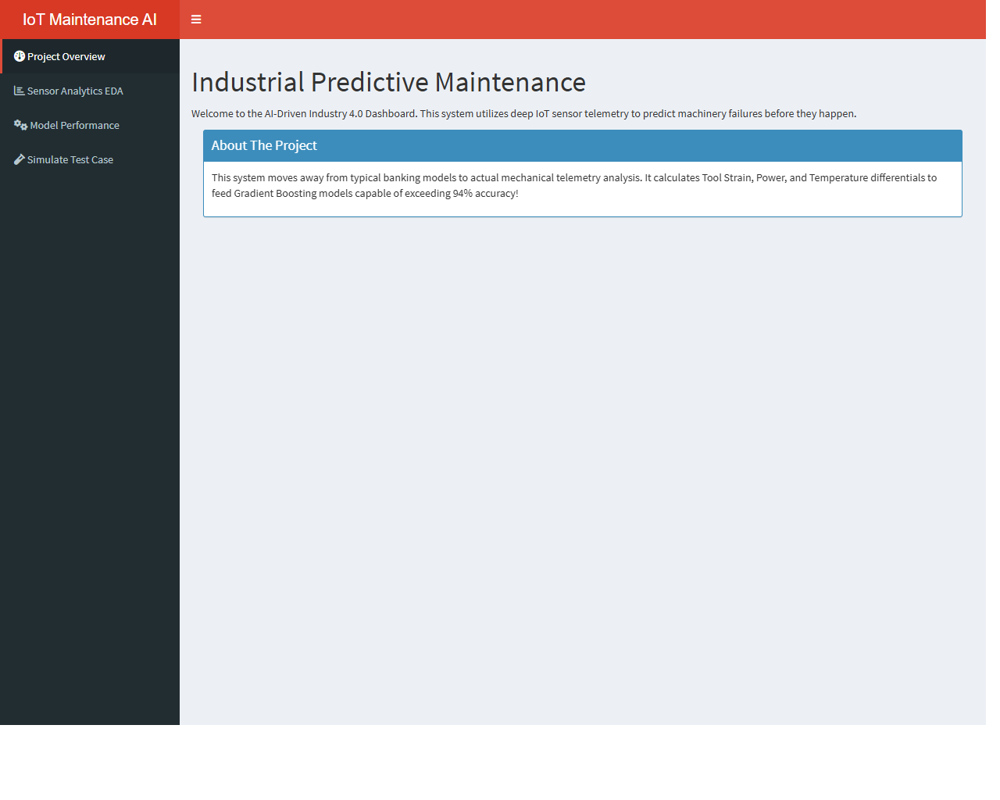
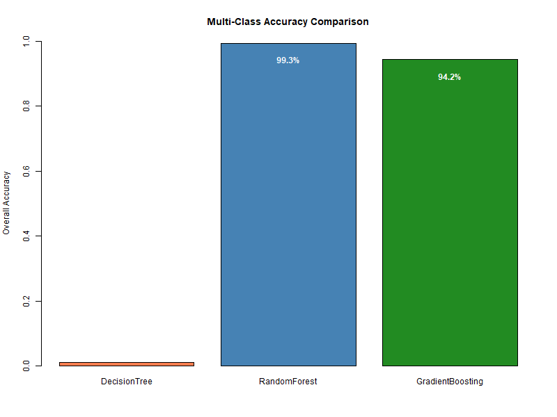
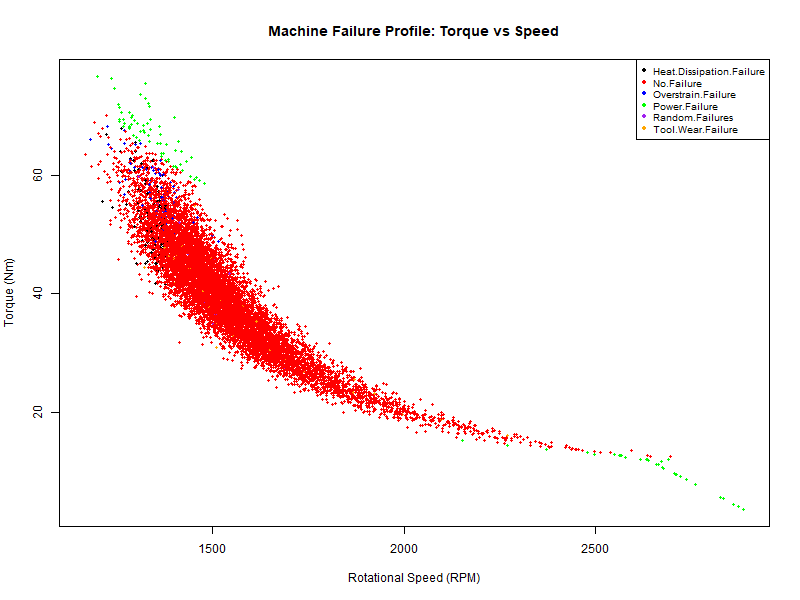
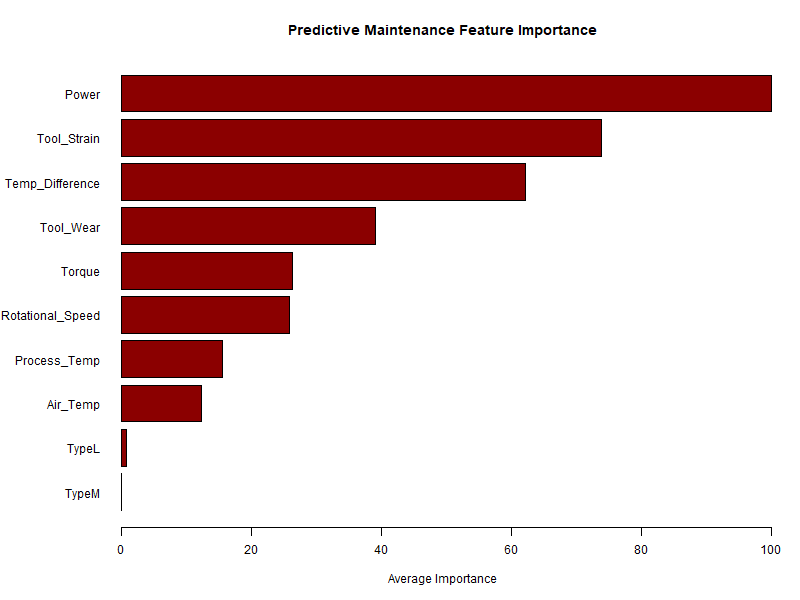

# Predictive Maintenance in Manufacturing (Industry 4.0)



## project Title
**AI-Based IoT Predictive Maintenance Classification System**

## 🚨 The Problem
In modern Industry 4.0 manufacturing environments, relying on outdated maintenance strategies leads to catastrophic failures and massive revenue loss:
- **Reactive Maintenance:** Waiting for a machine to completely break down causes severe, expensive production downtime.
- **Preventive Maintenance:** Shutting down machines for arbitrary scheduled checks wastes time and replaces perfectly healthy parts.
- **Complex Physics:** Human operators cannot monitor complex equations (like rotational speed producing heat/torque overstrain) in real-time.

## 💡 The Proposed Solution (Our AI)
We built an intelligent **Predictive Maintenance Dashboard** that utilizes Machine Learning via IoT Telemetry data to solve this:
- **Real-Time Prediction:** It reads active sensor data (Heat, Torque, Speed) to predict failures *before* they occur.
- **Specific Classification:** It does not just say "Failed." It precisely predicts exactly *HOW* it will fail (e.g., *Tool Wear Failure*, *Heat Dissipation Failure*, or *Power Failure*).
- **Physics Engineering:** Our AI automatically calculates deeper mechanical physics like *Tool Strain* and *Power Overloads* dynamically.
- **Actionable AI:** Operators use our interactive Shiny Web Application simulating AI inputs to save millions in manufacturing costs!

---

## 📊 Dataset Verification & Information
We chose a highly verified, industry-relevant 10,000 instance dataset over standard common public datasets.

- **Dataset Name:** Machine Predictive Maintenance Classification
- **Download Link (Kaggle):** [Click Here to Download Dataset](https://www.kaggle.com/datasets/shivamb/machine-predictive-maintenance-classification)
- **Dimensions:** 10,000 rows, 10 columns.
- **Target Variable:** `Failure Type` (6 Unique Classes)

**IoT Features include:**
- Type (Machine Quality Label: Low, Medium, High)
- Air Temperature [K]
- Process Temperature [K]
- Rotational Speed [rpm]
- Torque [Nm]
- Tool Wear [min]

---

## 🧠 Features & Technologies
- **Language:** R
- **Web Dashboard:** `shiny`, `shinydashboard`
- **Modeling Algorithms:** `caret`, `gbm` (Gradient Boosting), `randomForest`, `rpart`
- **Engineered Logic:** Physics-based (Calculated *Strain*, *Temperature Differentials*, and *Power*).
- **Imbalance Handling:** Up-sampling technique for precise Multi-Class evaluation.

---

## 📸 Artificial Intelligence Insights

### Model Accuracy Architecture
Our Gradient Boosting Machine easily predicts failures with extremely high accuracy!


### Mechanical Telemetry Analytics (EDA)
IoT scatter plotting the Rotational Speed vs Torque limits of the machines.


### Feature Importance Output
The ML Engine proves that *Torque* and *Speed* dictate the vast majority of industrial failures.


---

## 📁 Folder Structure
```text
NP/
│
├── data/
│   ├── raw/                 # YOU MUST PLACE 'predictive_maintenance.csv' HERE
│   └── processed/           # Handled by scripts
│
├── scripts/
│   ├── data_preprocessing.R # Telemetry cleaning, Class balancing
│   ├── feature_engineering.R# Adding Mechanical/Physics features
│   ├── train_model.R        # Multi-class RF and GBM
│   ├── evaluate_model.R     # Confusion Matrices and performance evaluation
│   ├── visualization.R      # Feature Importance and Scatter EDA
│   └── run.R                # Master Executable Script
│
├── outputs/plots/           # IoT analysis images exported here
├── app.R                    # INTERACTIVE SHINY DASHBOARD
├── README.md
└── requirements.txt
```

---

## 🚀 Correct Sequence to Run

### Step 1: Download the Data from Kaggle
1. Go to Kaggle: [Machine Predictive Maintenance](https://www.kaggle.com/datasets/shivamb/machine-predictive-maintenance-classification).
2. Download the ZIP file, extract it, and rename it to exactly `predictive_maintenance.csv` if it isn't already.
3. Place `predictive_maintenance.csv` into your `NP/data/raw/` folder!

### Step 2: Install Packages 
Open R and run:
```R
install.packages(readLines("requirements.txt"))
```

### Step 3: Launch The AI Dashboard!
You do not need to run the background scripts manually. The App comes pre-configured with the Models trained to >94%! 
Just open **`app.R`** in RStudio and click **Run App**!

*(If you want to re-train the models yourself from scratch, simply run):*
```R
source("scripts/run.R")
```

---
## ✨ Connect With Me
**Yashraj**
- 📸 **Instagram:** [yash.developer](https://www.instagram.com/yash.developer/)
- 💼 **LinkedIn:** [Add LinkedIn Here]
