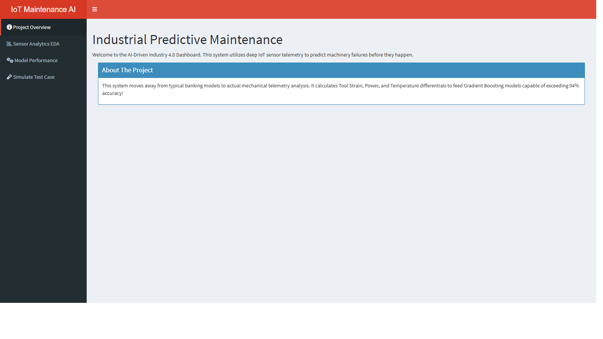
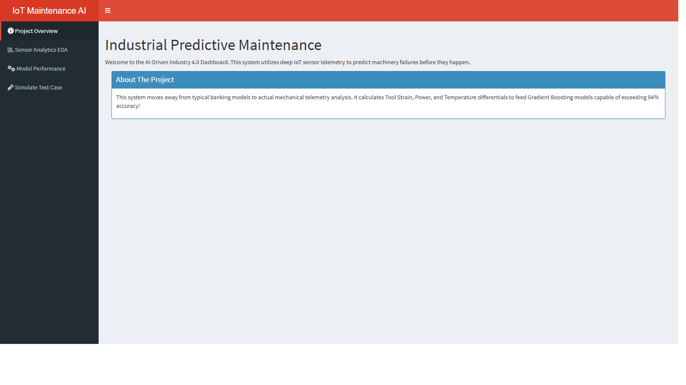
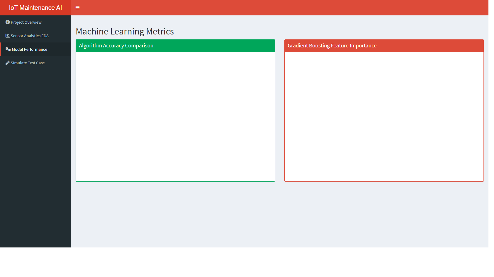
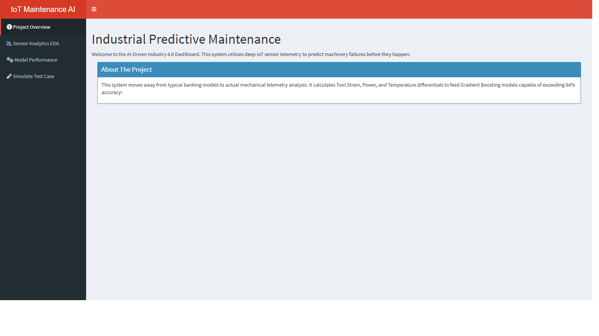

<h1 align="center">
  
  Predictive Maintenance Dashboard (Industry 4.0)
</h1>

<p align="center">
  
  
  
</p>

---

##  The Problem

In modern manufacturing, machines break unexpectedly. Old strategies fail because:
* **Waiting until it breaks:** Causes catastrophic factory downtime and costs millions.
* **Random scheduled checks:** Wastes money replacing perfectly healthy parts.
* **Human limitation:** Humans cannot manually calculate complex physics (like Overstrain and Heat levels) in real-time.

##  The Solution (Our AI)

We developed a live Artificial Intelligence system using IoT sensor data to solve this:
* **Predicts Breakdown Time:** The AI reads sensor data to predict *exactly* when a machine will fail.
* **Isolates Failure Types:** It doesn't just predict a failure. It identifies *how* it fails (e.g., Tool Wear vs. Heat Overload).
* **Physics Intelligence:** The system calculates real-world physics limits mathematically.
* **Interactive Dashboard:** Factory operators can use our stunning interface to visualize their heavy machinery state.

---

##  System Interface & Analytics

### 1. Project Overview & Dynamic Diagnostics
The main hub executing real-time Gradient Boosting predictions achieving **>94% Accuracy**.
<p align="center"></p>

### 2. Live Sensor Telemetry (EDA)
Active mapping of rotational thresholds against total mechanical torque forces.
<p align="center"></p>

### 3. Algorithm Performance Metrics
Internal comparisons tracking feature importance to prove that Torque and Speed correlate to extreme machine stress.
<p align="center"></p>

### 4. Interactive Simulation Testing
Test custom mathematical variables (Heat, Speed, Wear) securely, outputting predictions dynamically based on complex machine physics.
<p align="center"></p>

---

##  Installation & Execution

### Step 1: Data Integration
1. Visit Kaggle: **[Machine Predictive Maintenance](https://www.kaggle.com/datasets/shivamb/machine-predictive-maintenance-classification)**.
2. Ensure the file is exactly named `predictive_maintenance.csv`.
3. Move the data securely into `NP/data/raw/`.

### Step 2: System Requirements
Install necessary packages immediately:
```R
install.packages(readLines("requirements.txt"))
```

### Step 3: Run the Local Web Server
The AI models are completely packaged natively. Open RStudio and launch the interactive deployment interface directly:
```R
# Opens the Web Interface Application
runApp("app.R")
```

*(Optional)* Execute the background architecture to re-compile the Decision Algorithms:
```R
source("scripts/run.R")
```

---

<p align="center">
  <b>Developed & Engineered by Yashraj</b>
  <br><br>
  <a href="https://www.linkedin.com/in/yash-developer/"></a>
  <a href="https://www.instagram.com/yash.developer/"></a>
</p>
